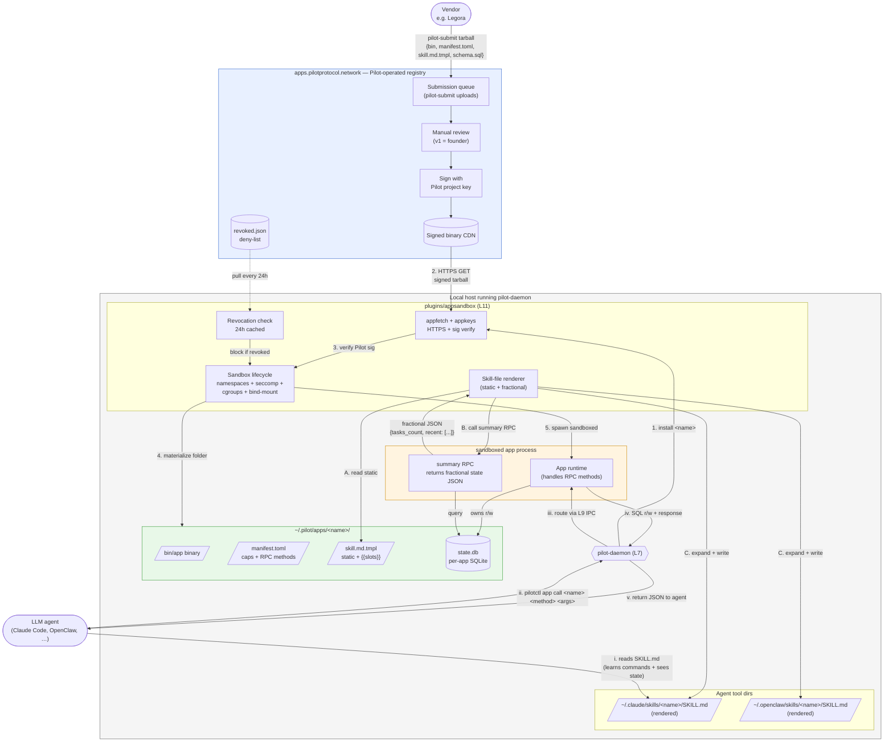

# Agent App Platform

> Status: DESIGN — pre-build, pending validation gate.
> Layer impact: new L11 plugin (`plugins/appsandbox`), new L11 server (`pkg/appstore/server`), new utilities (`pkg/appmanifest`, `pkg/appfetch`, `internal/appkeys`), new L12 binary (`cmd/pilot-submit`), extended L12 binary (`cmd/pilotctl`).

A curated app registry and sandboxed runtime that lets autonomous agents discover, install, and use stateful apps without human-in-the-loop setup. Apps are signed by Pilot project keys, distributed only via `apps.pilotprotocol.network`, and run inside per-app Linux sandboxes on the host daemon.

---

## Model

**Each compiled app binary ships with a skill-file template** (`skill.md.tmpl`):

- **Static parts** — vendor-authored, immutable instructions to the agent: what the app does, available RPC methods, schemas, examples. Signed in the tarball by the vendor and countersigned by Pilot at deploy.
- **Fractional parts** — slots in the template (Jinja-shaped: `{{tasks_count}}`, `{{recent: limit=5}}`) that the daemon's renderer fills at expansion time by calling the app's `summary` RPC. The RPC reads from the app's own SQLite database and returns a digest of current state.

The skill file is the agent's *map*. SQLite stays inside the sandbox; agents never touch it directly. SQL traversal is the app's job — exposed through manifest-declared RPC methods. The skill file describes which methods to call; the app implements them.

This is `skillinject` v2: instead of one global heartbeat injected into every agent tool dir, each installed app contributes one rendered SKILL.md to each tool dir. Generalizes the existing pattern; deprecates the single-heartbeat model.

---

## End-to-end flow



Three independent loops, deliberately separate:

1. **Install (1→5)** — runs once per app, on `pilotctl app install`. Pulls signed tarball, verifies against Pilot project key (pinned at compile in `internal/appkeys`), checks deny-list, materializes folder, spawns under sandbox primitives.
2. **Skill render (A→C)** — runs periodically (default 5 min) AND on app-published state-change events. The fractional memory expansion loop. Stays cheap: `summary` RPC returns a digest, never raw rows.
3. **Agent invocation (i→v)** — runtime hot path. Agent reads SKILL.md to learn commands and see digest state; calls happen via L9 IPC mediated by the daemon; app handles SQL internally; response returns as JSON.

---

## Why direct SQLite stubs are deliberately excluded from skill files

- The app's schema is implementation, not contract. Schema migrations would break agents if exposed.
- Arbitrary SQL from an LLM against a vendor's DB is a footgun (correctness, security, performance).
- The RPC surface is the stable contract. The vendor controls the queries; the agent stays at the API boundary.

If an app needs to expose richer query capability, the manifest declares additional RPC methods (`search`, `filter`, etc.) that the app implements over its own DB.

---

## Manifest example

```toml
name = "pilot-tasks"
version = "0.1.0"
publisher = "pilot-project"
signed-by = "ed25519:PILOT_PROJECT_KEY..."

[capabilities]
allowed-network = []                          # this app needs no outbound
allowed-fs      = ["state.db", "cache/"]      # paths relative to bind-mount root
exec            = "none"

[sqlite]
schema = "schema.sql"

[rpc]
methods = ["add", "list", "complete", "summary"]
# summary is the fractional-render contract: returns
# { tasks_count: int, recent: [{title, ts}], in_progress: int }
```

---

## Skill file template example

```markdown
# pilot-tasks

A persistent task queue. Use this app for any task you want to remember across sessions.

## Current state
- You have {{tasks_count}} open tasks.
- {{in_progress}} in progress.
- Recent: {{recent | bullet_list}}

## Commands
- `pilotctl app call pilot-tasks add '{"title": "..."}'` — create a task
- `pilotctl app call pilot-tasks list` — list open tasks
- `pilotctl app call pilot-tasks complete '{"id": "..."}'` — mark complete
```

After rendering with live state:

```markdown
# pilot-tasks

A persistent task queue. Use this app for any task you want to remember across sessions.

## Current state
- You have 3 open tasks.
- 1 in progress.
- Recent:
  - draft contract for Acme
  - review PR #1247
  - file weekly status

## Commands
- `pilotctl app call pilot-tasks add '{"title": "..."}'` — create a task
- `pilotctl app call pilot-tasks list` — list open tasks
- `pilotctl app call pilot-tasks complete '{"id": "..."}'` — mark complete
```

---

## Layer mapping (cross-reference with `layers.yaml`)

| Component | Layer | Package |
|---|---|---|
| Manifest TOML schema + parser | utility | `pkg/appmanifest/` |
| Pilot project pubkey + sig verify | utility | `internal/appkeys/` |
| HTTPS fetch + verify of signed tarball | utility | `pkg/appfetch/` |
| Sandbox runtime (namespaces, seccomp, cgroups, bind-mount) | L11 plugin | `plugins/appsandbox/` |
| Agent ↔ app IPC routing | L11 plugin (inside appsandbox) | uses L9 via L10 contract |
| App outbound network mediation | L11 plugin (inside appsandbox) | uses L10 `Streams` |
| Skill-file renderer | L11 plugin (inside appsandbox) | replaces `plugins/skillinject` semantics |
| `pilotctl app *` subcommands | L12 | `cmd/pilotctl/` (extension) |
| `pilot-submit` CLI | L12 | `cmd/pilot-submit/` (new) |
| Registry server (queue + review + sign + CDN + deny-list publish) | L11 server | `pkg/appstore/server/` |
| Server binary | L12 | `cmd/appstore-server/` |

No new layer is required. All imports remain strictly downward (P1). Wire formats L1/L4/L5/L6/L7 are untouched (P6).

---

## Prerequisites flagged by the existing architecture docs

The following items in `web4-private/architecture-notes/` become **blocking** for the appsandbox plugin, not merely transitional:

1. **Per-plugin panic supervisor** (`03-INVARIANTS.md §8`). Today, an L11 plugin panic kills the daemon. `appsandbox` manages N child processes — a panic during app lifecycle kills the daemon AND orphans every running app. Must ship before `appsandbox` launches.
2. **T7.1 — plugin lifecycle out of `pkg/daemon` into `cmd/daemon`** (`layers.yaml` transitional). Today `pkg/daemon (L7)` imports `pkg/coreapi (L10)` — wrong direction. Must resolve before introducing a heavier plugin.
3. **Audit #15 — `TestDaemonShutdownStopsGoroutines`** (`03-INVARIANTS.md §4`). Listed as "the prerequisite for all extraction work." `appsandbox` adds goroutines per running app; without the baseline test, sandbox lifetime leaks are invisible.

These are not new concerns; the architecture docs already track them. The agent app platform makes them load-bearing instead of background hygiene.

---

## Out of scope for v1

- Cross-host app calls (agent on host A invoking app on host B). v1 is local-host install only.
- App → app composition. v1 forbids one app calling another; capability composition deferred to v1.1.
- Schema migrations (`migrations/` directory in tarball). v1 = single-version installs only.
- Python SDK. v1 ships Go SDK in `pkg/appclient/`; most LLM agents are Python-shaped, so this is a known tradeoff.
- Multi-reviewer submission workflow. v1 = founder-manual review at ≤1 app/week throughput.
- Automated submission scanning (static/dynamic analysis, malware). v1.1+.
- Per-app billing/metering.
- Confidential computing / TEE. Apps trust the host.

---

## Open questions

The current open items most relevant to this doc:

- First-party reference app: `pilot-tasks` or `pilot-data`? `pilot-tasks` directly demonstrates the state-inversion thesis.
- Skill-render frequency and event triggers (currently default 5 min periodic + on state-change events).
- Multi-tenant blast radius for one host running many apps.
- App crash + state recovery semantics.

---

## See also

- `layers.yaml` — single source of truth for layer membership
- `web4-private/architecture-notes/01-LAYERS.md` — full layer definitions
- `web4-private/architecture-notes/03-INVARIANTS.md` — the ten principles + state ownership + lock graph + panic boundaries
- `internal/skillinject/` — v1 of the skill-injection mechanism this platform generalizes
